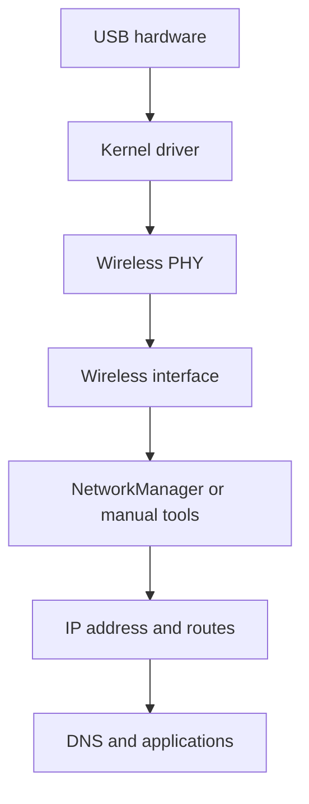
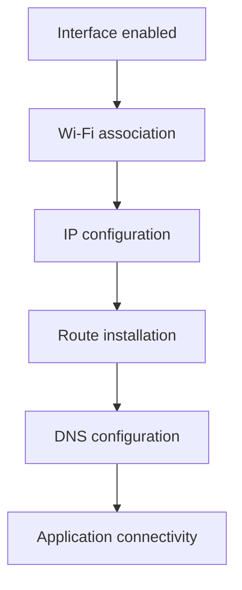

# Lab 02 — Linux Wi-Fi Interface Management

## Objective

Understand how Linux represents and manages a Wi-Fi adapter across the USB,
driver, wireless-PHY, network-interface, NetworkManager and IP-routing layers.

This lab uses the Alfa AWUS036ACH as a disconnected experimental adapter while
the laptop's internal Intel Wi-Fi adapter maintains internet connectivity.

## Learning Outcomes

After completing this lab, the learner should be able to:

- Distinguish a physical Wi-Fi radio from a network interface.
- Explain the relationship between a PHY, `wdev`, `ifindex` and interface name.
- Interpret administrative, operational, carrier and association states.
- Understand the different roles of `ip`, `iw`, `nmcli` and `rfkill`.
- Temporarily exclude an interface from NetworkManager.
- Explain why an enabled Wi-Fi interface may still report `DOWN`.
- Separate Wi-Fi association, IP configuration, routing and DNS.
- Diagnose multiple IPv4 addresses on one interface.
- Recognize device re-enumeration through changing kernel identifiers.

## Test Environment

| Item | Value |
|---|---|
| Operating system | Ubuntu Linux |
| Kernel | `6.17.0-40-generic` |
| Experimental adapter | Alfa AWUS036ACH |
| Chipset | Realtek RTL8812AU |
| Driver | `rtw88_8812au` |
| Alfa interface | `wlx00c0caXXXXXX` |
| Alfa initial mode | Managed/client |
| Internal interface | `wlp0s20f3` |
| Network manager | NetworkManager |

MAC addresses, BSSIDs and the local SSID are anonymized in this public
documentation.

## 1. Linux Wi-Fi Architecture

A Wi-Fi adapter is represented at several layers:



### USB hardware

The physical AWUS036ACH is detected as:

```text
USB ID 0bda:8812
```

### Kernel driver

The driver translates Linux wireless operations into commands understood by
the RTL8812AU hardware:

```text
rtw88_8812au
```

### Wireless PHY

A PHY represents the physical radio and its capabilities, including:

- Supported frequency bands
- Channel widths
- Interface modes
- Transmit-power limits
- Permitted interface combinations

A PHY name such as `phy91` is dynamically allocated and can change after a USB
reconnection or driver reload.

### Wireless interface

The network interface is the object normally used by applications and
configuration tools:

```text
wlx00c0caXXXXXX
```

The interface name remained stable because it was derived from the adapter's
MAC address, even when PHY and interface indices changed.

## 2. Linux Wireless and Networking Tools

| Tool | Layer | Purpose |
|---|---|---|
| `lsusb` | USB | Identify the physical USB device |
| `lsmod` | Kernel | Show loaded driver modules |
| `iw` | Wi-Fi | Inspect PHYs, channels, modes and association |
| `ip` | Networking | Control generic link state, addresses and routes |
| `nmcli` | Management | Control NetworkManager devices and profiles |
| `rfkill` | Radio control | Inspect software and hardware radio blocks |

These tools provide complementary views. No single command completely
describes the state of a Wi-Fi connection.

## 3. PHY, `wdev`, `ifindex` and Interface Name

Example `iw` output:

```text
Interface wlx00c0caXXXXXX
    ifindex 60
    wdev 0x3a00000001
    type managed
    wiphy 58
    txpower 20.00 dBm
```

### `ifindex`

`ifindex` is the kernel's numeric identifier for a network-interface instance.

It can change when the interface is destroyed and recreated. Scripts should
normally use the interface name rather than a hard-coded index.

### `wdev`

`wdev` is the wireless-device identifier used internally by `cfg80211`.

The approximate relationship is:

```text
PHY
└── Wireless device (wdev)
    └── Network interface
```

### `wiphy`

`wiphy 58` means that the interface belongs to `phy58`.

### `type managed`

Managed mode means that the interface operates as a Wi-Fi station/client. It
can scan, authenticate and associate with an access point.

### `txpower`

A reported setting of `20 dBm` corresponds to:

\[
P_{\mathrm{mW}}=10^{P_{\mathrm{dBm}}/10}=10^{20/10}=100\ \mathrm{mW}
\]

This is a configured driver value, not proof that every frame is transmitted
at exactly 100 mW. Channel restrictions, hardware calibration, rate control
and regulatory rules may reduce actual transmit power.

## 4. Administrative and Operational State

The disconnected Alfa interface initially appeared as:

```text
wlx00c0caXXXXXX DOWN <NO-CARRIER,BROADCAST,MULTICAST,UP>
```

This is not contradictory.

| Field | Meaning |
|---|---|
| `UP` flag | Interface is administratively enabled |
| `state DOWN` | No operational Layer-2 link exists |
| `NO-CARRIER` | No active carrier or Wi-Fi association |
| `BROADCAST` | Interface supports broadcast traffic |
| `MULTICAST` | Interface supports multicast traffic |

The interface was enabled but not associated with an access point.

### Administrative shutdown

The interface was disabled using:

```bash
sudo ip link set dev "$ALFA_IF" down
```

Result:

```text
<BROADCAST,MULTICAST>
```

The `UP` flag disappeared.

It was enabled again using:

```bash
sudo ip link set dev "$ALFA_IF" up
```

Result:

```text
<NO-CARRIER,BROADCAST,MULTICAST,UP>
```

Bringing the interface up did not associate it with an access point.

## 5. Other `ip link` Fields

Example:

```text
mtu 1500 qdisc noqueue state DOWN mode DORMANT group default qlen 1000
```

| Field | Meaning |
|---|---|
| `mtu 1500` | Maximum Layer-3 packet size under normal configuration |
| `qdisc noqueue` | No conventional software queue is shown |
| `DORMANT` | Enabled but waiting for an event such as association |
| `group default` | Interface belongs to the default administrative group |
| `qlen 1000` | Configured transmit queue length |

`mode DORMANT` is a generic operational state. It is unrelated to the Wi-Fi
interface types `managed` and `monitor`.

## 6. NetworkManager State

NetworkManager initially reported:

```text
GENERAL.STATE: 30 (disconnected)
GENERAL.REASON: 42 (The supplicant is now available)
GENERAL.NM-MANAGED: yes
```

`wpa_supplicant` handles operations such as:

- Scanning
- Authentication
- Association
- WPA key negotiation
- Connection maintenance

Reason 42 was not an error. It indicated that the supplicant was available but
no connection was active.

NetworkManager reported `disconnected` while the kernel interface was both
administratively up and administratively down. Therefore, `nmcli` alone does
not reveal the complete kernel link state.

## 7. NetworkManager Ownership Experiment

NetworkManager ownership was disabled only for the Alfa adapter:

```bash
sudo nmcli device set "$ALFA_IF" managed no
```

The result was:

```text
NetworkManager state: unmanaged
Kernel interface: present
Wi-Fi type: managed
```

The term `managed` has two different meanings:

| Context | Meaning |
|---|---|
| NetworkManager-managed | NetworkManager owns and configures the interface |
| Wi-Fi type managed | Interface behaves as a station/client |

An interface can therefore be unmanaged by NetworkManager while its Wi-Fi type
remains managed.

With NetworkManager excluded, manual down and up operations remained under
direct user control.

Ownership was restored using:

```bash
sudo nmcli device set "$ALFA_IF" managed yes
```

## 8. RF-kill Concepts

`rfkill` reports whether radio operation is blocked.

```bash
rfkill --output ID,TYPE,DEVICE,SOFT,HARD
```

### Soft block

A software-controlled radio block can normally be removed with `rfkill`.

### Hard block

A hard block may be imposed by:

- A physical wireless switch
- Firmware
- BIOS or UEFI
- Platform hardware control

A software command cannot necessarily override a hard block.

### PHY and RF-kill identifiers

The experiment observed values such as:

```text
Wireless PHY: phy91
RF-kill ID: 90
```

These identifiers belong to different kernel subsystems and are not expected
to have matching numbers.

## 9. RF-kill Experiment and USB Re-enumeration

A targeted soft block was applied only to the Alfa RF-kill entry. Afterward,
the adapter underwent repeated USB disconnect and reconnect events.

Observed sequence:

```text
USB disconnect
    ↓
New SuperSpeed USB device
    ↓
Firmware 52.14.0 initialized
    ↓
New PHY and RF-kill entry created
    ↓
Temporary wlan0 interface created
    ↓
Interface renamed to the MAC-based name
    ↓
NetworkManager and wpa_supplicant reattached
```

The RF-kill ID changed after re-enumeration, making the previously stored ID
obsolete.

The internal Intel adapter also temporarily appeared unavailable in
NetworkManager, although its kernel RF-kill entry remained unblocked.

All Wi-Fi software blocks were safely restored using:

```bash
sudo rfkill unblock wifi
sudo nmcli radio wifi on
```

### Evidence-based interpretation

Confirmed observations:

- Repeated USB disconnect and reconnect events occurred.
- PHY, RF-kill and interface indices changed.
- The persistent interface name remained stable.
- NetworkManager responded correctly to removal and addition events.
- Firmware initialized successfully after each enumeration.
- The adapter eventually recovered.

Possible but unconfirmed explanation:

- The RF-kill transition may have triggered or exposed a driver, firmware, USB
  power or hardware stability issue.

The experiment did not establish causality. Targeted RF-kill blocking will not
be repeated with this driver/device combination without a separate controlled
investigation.

## 10. Timestamped Stability Verification

A timestamped 60-second read-only test was performed after recovery.

Initial state:

```text
ifindex 198
wiphy 197
USB device 066
txpower 20.00 dBm
```

Final state:

```text
ifindex 198
wiphy 197
USB device 066
txpower 20.00 dBm
```

No new USB or driver events appeared during the exact test window.

Conclusion:

> The adapter experienced a transient re-enumeration sequence and subsequently
> remained stable during the measured 60-second observation.

A longer test would be required to claim long-term stability.

## 11. Wi-Fi Connection Stages

A complete connection involves several separate stages:



### Stage 1: Interface enabled

```bash
ip link show dev "$IFACE"
```

Look for the `UP` flag.

### Stage 2: Wi-Fi association

```bash
iw dev "$IFACE" link
```

A connected interface reports BSSID, SSID, signal, frequency and bitrate. A
disconnected interface reports:

```text
Not connected.
```

### Stage 3: IP configuration

```bash
ip address show dev "$IFACE"
```

An address may be assigned through DHCP or static configuration.

### Stage 4: Routing

```bash
ip route show dev "$IFACE"
```

A default route resembles:

```text
default via <gateway> dev <interface>
```

### Stage 5: DNS

NetworkManager DNS configuration can be viewed with:

```bash
nmcli -f IP4.DNS device show "$IFACE"
```

Working IP connectivity with failed name resolution normally indicates a DNS
problem rather than a Wi-Fi-association problem.

## 12. Connected and Disconnected Comparison

The connected internal Intel adapter and disconnected Alfa adapter produced:

| Stage | Internal Intel | Alfa AWUS036ACH |
|---|---|---|
| Driver loaded | Yes | Yes |
| Interface enabled | Yes | Yes |
| Wi-Fi association | Connected | Not connected |
| Operational carrier | Yes | No |
| IPv4 address | Present | None |
| Subnet route | Present | None |
| Default gateway | Present | None |
| DNS | Present | None |

This demonstrates that successful driver loading and an enabled interface are
only the first stages of connectivity.

## 13. Connected-Link Interpretation

The internal adapter reported:

```text
Frequency: 5320 MHz
Signal: -54 dBm
Channel width: 80 MHz
Spatial streams: 2
```

Frequency 5320 MHz corresponds to channel 64:

\[
\text{Channel}=\frac{5320-5000}{5}=64
\]

A signal of approximately `-54 dBm` represents a strong received signal.

The reported PHY rates were higher than expected application throughput
because Wi-Fi airtime also includes contention, acknowledgements, encryption,
headers, inter-frame spacing and retransmissions.

These 802.11ax/HE results describe the internal Intel adapter, not the
802.11ac AWUS036ACH.

## 14. Intentional Static and DHCP Addresses

The internal interface had two IPv4 addresses:

```text
192.168.1.45/24
192.168.1.43/24
```

The NetworkManager profile contained:

```text
ipv4.method: auto
ipv4.addresses: 192.168.1.45/24
ipv4.gateway: 192.168.1.1
```

`auto` enabled DHCP, while the explicitly stored `.45` address was applied in
addition to the DHCP-provided `.43` address.

This hybrid configuration was intentional and created for learning purposes.

Linux selected `.45` as the source for both internet and local-subnet traffic:

```bash
ip route get 1.1.1.1
ip route get 192.168.1.100
```

Conceptual result:

```text
Internet destination → gateway → source 192.168.1.45
Local destination → direct link → source 192.168.1.45
```

No independent `dhclient` or `dhcpcd` process was running. NetworkManager
handled the DHCP address.

A fixed address should be reserved in the router or placed outside the DHCP
allocation pool to prevent another device from receiving the same address.

## 15. Shell Variable Case Sensitivity

This command failed:

```bash
nmcli device show "$alfa_IF"
```

because the configured variable was:

```bash
ALFA_IF=wlx00c0caXXXXXX
```

Bash variable names are case-sensitive:

```text
$ALFA_IF is not the same as $alfa_IF
```

The undefined lowercase variable expanded to an empty string, producing:

```text
Error: Device '' not found.
```

## Useful Diagnostic Sequence

A systematic Wi-Fi interface check can use:

```bash
IFACE=<wireless-interface>

lsusb
lsmod | grep -E 'rtw88|8812'
rfkill list
iw dev "$IFACE" info
iw dev "$IFACE" link
ip link show dev "$IFACE"
ip address show dev "$IFACE"
ip route show dev "$IFACE"
nmcli device show "$IFACE"
```

The sequence moves from hardware and driver state toward association and
Layer-3 configuration.

## Key Findings

1. PHY, RF-kill, `wdev` and interface indices identify different kernel
   objects.
2. Dynamically allocated identifiers can change after device recreation.
3. The MAC-based Alfa interface name remained stable.
4. Administrative `UP` does not imply Wi-Fi association or operational carrier.
5. NetworkManager ownership is independent of Wi-Fi managed/client mode.
6. `nmcli disconnected` does not reveal whether the kernel interface is up.
7. RF-kill state is independent of generic interface administrative state.
8. The RF-kill experiment was followed by transient USB re-enumeration.
9. NetworkManager and `wpa_supplicant` recovered automatically.
10. Association, IP addressing, routing and DNS are separate connectivity
    stages.
11. NetworkManager can combine an additional static address with DHCP.
12. Linux selected the explicit `.45` address as the preferred source.

## Conclusion

The AWUS036ACH was successfully controlled through `ip`, `iw` and
NetworkManager. The experiments demonstrated how Linux separates physical
radio state, administrative interface state, NetworkManager ownership, Wi-Fi
association and IP connectivity.

An unexpected USB re-enumeration sequence following the RF-kill experiment was
recorded without overstating its cause. After recovery, the adapter passed a
timestamped 60-second stability test.
