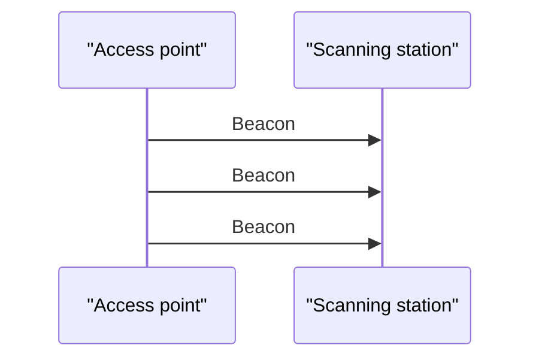
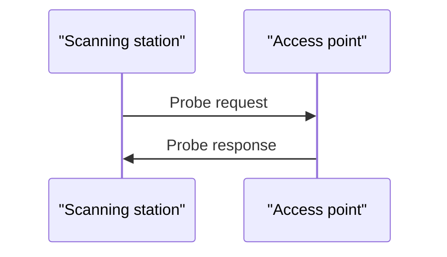

# Lab 03 — Wi-Fi Channel Scanning and Network Discovery

## Objective

Understand how Wi-Fi stations discover access points, interpret scan results
at different Linux abstraction levels and generate anonymized, reproducible
wireless-survey reports using the Alfa AWUS036ACH.

## Learning Outcomes

After completing this lab, the learner should be able to:

- Explain passive and active Wi-Fi scanning.
- Distinguish an SSID from a BSSID.
- Convert Wi-Fi channel numbers to frequencies.
- Explain channel overlap in the 2.4 GHz band.
- Interpret signal measurements in dBm.
- Distinguish normalized signal quality from received power.
- Interpret 20, 40 and 80 MHz channel operation.
- Recognize DFS-channel implications.
- Compare NetworkManager and `iw` scan results.
- Explain why repeated scans may discover different BSS counts.
- Generate a privacy-safe Markdown scan report.
- Validate a Bash script’s success and failure paths.

## Test Environment

| Item | Value |
|---|---|
| Operating system | Ubuntu Linux |
| Kernel | `6.17.0-40-generic` |
| Adapter | Alfa AWUS036ACH |
| Chipset | Realtek RTL8812AU |
| Driver | `rtw88_8812au` |
| Interface | Anonymized |
| Regulatory domain | UAE (`AE`) |
| Interface mode | Managed/client |
| NetworkManager state | Managed and disconnected |

SSIDs, BSSIDs and MAC addresses are intentionally excluded from committed
reports.

## 1. Wi-Fi Discovery

Before connecting, a station must discover nearby Basic Service Sets.

A scan result may contain:

| Field | Meaning |
|---|---|
| SSID | Human-readable network name |
| BSSID | MAC address of an individual AP radio |
| Frequency | RF center frequency |
| Channel | Standardized channel number |
| Signal | Received signal strength |
| Security | Advertised authentication and cipher capabilities |
| Channel width | Occupied 20, 40, 80 or wider channel allocation |

One SSID may be advertised by multiple BSSIDs:

```text
SSID: Example-WiFi
├── BSSID A on channel 1
├── BSSID B on channel 36
└── BSSID C on channel 100
```

This is common in enterprise, dual-band and mesh deployments.

## 2. Passive Scanning

In passive scanning, the station listens for beacon frames periodically
transmitted by access points.



Beacon frames can advertise:

- SSID
- Channel
- Supported rates
- Security capabilities
- HT/VHT/HE capabilities
- Timing information
- Vendor-specific information

Passive scanning creates less active RF traffic and can observe channels on
which initiating radiation is prohibited. It may take longer because the
station must wait for beacons.

## 3. Active Scanning

In active scanning, the station transmits a probe request and listens for probe
responses.



Active scanning is often faster but generates RF transmissions and must follow
regulatory restrictions.

`no IR` means that independently initiating radiation is prohibited. A station
may still be able to listen passively or join a network whose operation was
initiated by an authorized access point.

## 4. NetworkManager Scan

A high-level scan was requested using:

```bash
nmcli -f CHAN,FREQ,SIGNAL,BARS,RATE,SECURITY \
    device wifi list ifname "$ALFA_IF" --rescan yes
```

NetworkManager provides a compact view suitable for selecting a network.

| Field | Meaning |
|---|---|
| `CHAN` | Primary channel |
| `FREQ` | Frequency in MHz |
| `SIGNAL` | Normalized quality from 0 to 100 |
| `BARS` | Visual signal-quality representation |
| `RATE` | Advertised rate estimate |
| `SECURITY` | High-level security summary |

`--rescan yes` requests a new scan instead of relying only on cached results.

## 5. Low-Level `iw` Scan

A lower-level scan was captured temporarily:

```bash
sudo iw dev "$ALFA_IF" scan > /tmp/awus036ach-iw-scan.txt
```

The raw result was kept outside the repository because it contained SSIDs and
BSSIDs.

`iw` exposed information such as:

- Signal in dBm
- HT operation
- VHT operation
- Primary channel
- Secondary-channel offset
- Center-frequency segment
- RSN information elements

The raw temporary scan must not be committed.

## 6. Channel-to-Frequency Mapping

### 2.4 GHz channels 1–13

\[
f_{\mathrm{MHz}}=2407+5n
\]

Examples:

\[
f_1=2407+5(1)=2412\text{ MHz}
\]

\[
f_6=2407+5(6)=2437\text{ MHz}
\]

\[
f_{11}=2407+5(11)=2462\text{ MHz}
\]

Channel 14 is a special exception at 2484 MHz and was disabled under the
observed regulatory configuration.

### Common 5 GHz mapping

\[
f_{\mathrm{MHz}}=5000+5n
\]

Examples:

\[
f_{36}=5000+5(36)=5180\text{ MHz}
\]

\[
f_{64}=5000+5(64)=5320\text{ MHz}
\]

## 7. 2.4 GHz Channel Overlap

Adjacent 2.4 GHz channel centers are separated by 5 MHz, while a typical Wi-Fi
channel occupies approximately 20 MHz.

Therefore, adjacent channels overlap substantially.

For 20 MHz deployments, channels 1, 6 and 11 are conventionally used as a
non-overlapping set:

```text
Channel 1        Channel 6        Channel 11
2412 MHz         2437 MHz         2462 MHz
```

The experiment also observed channel 9. Channel 9 overlaps substantially with
both channels 6 and 11.

Actual interference depends on more than channel numbers:

- Received power
- Airtime utilization
- Traffic load
- Channel width
- Distance
- Receiver filtering
- Physical obstructions

## 8. Signal Strength

The low-level scan reported signals between approximately:

```text
-30 dBm and -72 dBm
```

A general interpretation is:

| Signal | Approximate interpretation |
|---:|---|
| −30 dBm | Extremely strong |
| −50 to −60 dBm | Strong |
| −60 to −67 dBm | Good |
| −67 to −75 dBm | Usable depending on application |
| Below −80 dBm | Weak |

A difference in dB represents a power ratio:

\[
\frac{P_2}{P_1}=10^{\Delta P/10}
\]

A 34 dB difference corresponds to approximately:

\[
10^{34/10}\approx2512
\]

Received power does not translate linearly into throughput.

### Signal is not SNR

Signal-to-noise ratio is:

\[
\mathrm{SNR}_{dB}=P_{\mathrm{signal,dBm}}-P_{\mathrm{noise,dBm}}
\]

The scan did not report a noise floor, so SNR could not be calculated.

## 9. Normalized Signal Percentage

NetworkManager reported several strong entries as 100, even though `iw`
reported different dBm values.

Normalized quality is useful for user interfaces but can hide differences
between strong signals.

For RF measurements:

```text
-38 dBm versus -44 dBm
```

is more informative than:

```text
100% versus 97%
```

## 10. Advertised Rate Versus Throughput

NetworkManager displayed rates such as:

```text
270 Mbit/s
540 Mbit/s
```

These are not application-throughput measurements.

Actual throughput is reduced by:

- MAC headers
- IP and transport headers
- WPA security overhead
- Inter-frame spacing
- Contention and backoff
- Acknowledgements
- Retransmissions
- Half-duplex medium access

Throughput will be measured independently in a later lab.

## 11. Channel-Width Interpretation

The scan found 20, 40 and 80 MHz operation.

### 20 MHz

```text
secondary channel offset: no secondary
STA channel width: 20 MHz
```

Only the primary 20 MHz channel was used.

### 40 MHz in 2.4 GHz

```text
primary channel: 1
secondary channel offset: above
```

This indicates HT40+ operation: the secondary 20 MHz channel is above the
primary.

Using 40 MHz in 2.4 GHz occupies a large portion of the available spectrum.

### 80 MHz centred on channel 42

```text
primary channel: 36
channel width: 80 MHz
center frequency segment: 42
```

Center frequency:

\[
5000+5(42)=5210\text{ MHz}
\]

The block contains channels:

```text
36, 40, 44 and 48
```

### 80 MHz centred on channel 58

```text
primary channel: 64
secondary channel offset: below
center frequency segment: 58
```

Center frequency:

\[
5000+5(58)=5290\text{ MHz}
\]

The block contains channels:

```text
52, 56, 60 and 64
```

This block is subject to DFS requirements under the UAE regulatory domain.

## 12. Security Information

Every observed entry contained an RSN information element.

RSN can advertise:

- Pairwise cipher
- Group cipher
- Authentication and key-management suite
- Management-frame protection capability
- Management-frame protection requirement

`RSN present` alone does not prove whether a network uses WPA2, WPA3 or a
transition configuration. The high-level NetworkManager scan reported both
WPA2-only and WPA2/WPA3 entries.

## 13. Non-Advertised SSIDs

Some BSS entries did not contain an SSID line in the filtered scan.

Possible explanations include:

- Empty SSID information element
- Intentionally hidden SSID
- Non-transmitted multiple-BSSID profile
- Unusual beacon or probe-response structure

The report conservatively records:

```text
Not advertised
```

It does not claim that the network is definitively hidden.

## 14. Scan Variability

Repeated scans discovered different numbers of entries:

```text
Scan 1: 9 BSS entries
Scan 2: 9 BSS entries
Scan 3: 7 BSS entries
```

A scan is a time-limited snapshot. An entry may be missed because:

- No beacon was decoded during channel dwell time.
- A probe response was lost.
- Multipath fading reduced received power.
- The access point changed channel.
- Interference prevented frame decoding.
- The access point was temporarily unavailable.

A serious RF survey should perform repeated scans and aggregate observations.

## 15. Automated Scan-Summary Script

The reusable script is located at:

```text
scripts/wifi-scan-summary.sh
```

Usage:

```bash
./scripts/wifi-scan-summary.sh INTERFACE [OUTPUT_FILE]
```

Example:

```bash
./scripts/wifi-scan-summary.sh wlx00c0caXXXXXX
```

The script:

1. Validates required commands.
2. Verifies that the interface is wireless.
3. Maps the interface to its PHY.
4. Checks soft and hard RF-kill state.
5. Reads the global regulatory country.
6. stores raw scan data in a restricted temporary file.
7. Parses scan results using AWK.
8. Excludes SSIDs and BSSIDs.
9. Generates an anonymized Markdown table.
10. Deletes raw temporary data.
11. Publishes the final report only after successful generation.

## 16. Script Bugs Found During Testing

### Substring-matching bug

The initial logic used:

```bash
[[ "$RF_STATE" == *blocked* ]]
```

This incorrectly matched:

```text
unblocked
```

because `unblocked` contains the substring `blocked`.

The corrected implementation parses and compares exact states:

```bash
read -r SOFT_STATE HARD_STATE <<< "$RF_STATE"

[[ "$SOFT_STATE" == "unblocked" ]]
[[ "$HARD_STATE" == "unblocked" ]]
```

### AWK portability bug

A parenthesized, multi-line `printf(...)` statement produced a syntax error
with the system AWK implementation.

It was replaced by the portable statement form:

```awk
printf "format", argument1, argument2
```

### Center-segment interpretation

A center-segment field associated with a 20/40 MHz result was initially
displayed. The parser was refined to show center segments only where they are
meaningful for wider VHT operation.

## 17. Atomic Report Generation

The script writes the report to a temporary file in the destination directory:

```text
.scan-report.XXXXXX
```

Only after successful parsing is it renamed to the final report.

If generation fails:

```text
Temporary report → deleted
Final report     → not created
```

This prevents partial or empty reports from being mistaken for valid results.

## 18. Privacy Controls

The report excludes:

- SSIDs
- BSSIDs
- Adapter MAC addresses
- Credentials
- Raw information elements

Timestamped reports are ignored using:

```gitignore
scan-summary-*.md
!sample-scan-summary.md
```

Only one reviewed and anonymized example is preserved:

[Sample anonymized scan report](results/sample-scan-summary.md)

## 19. Script Validation

Bash syntax was checked using:

```bash
bash -n scripts/wifi-scan-summary.sh
```

Tested failure paths:

| Test | Expected result | Result |
|---|---|---|
| Missing interface argument | Usage and exit status 1 | Passed |
| Invalid interface | Error and exit status 1 | Passed |
| Partial temporary report | No file left behind | Passed |
| Valid scan | Anonymized Markdown report | Passed |

ShellCheck was not installed, so optional ShellCheck static analysis was not
performed.

## 20. Limitations

The script does not currently:

- Aggregate multiple scans.
- Measure the noise floor.
- Calculate SNR.
- Measure channel utilization.
- Decode every RSN cipher and AKM suite.
- Determine whether a missing SSID is intentionally hidden.
- Measure application throughput.
- Detect non-Wi-Fi interference.

These are candidates for later extensions.

## Key Findings

1. NetworkManager and `iw` discovered the same number of BSS entries during
   the initial comparison.
2. `iw` provided more useful RF detail than normalized NetworkManager output.
3. The environment contained 2.4 GHz and 5 GHz BSS entries.
4. Channels 1, 6, 9, 11, 36 and 64 were observed.
5. Channel 9 overlapped with the conventional 1/6/11 allocation.
6. Both 20/40 MHz and 80 MHz operation were present.
7. The strongest observed signals saturated NetworkManager's quality scale.
8. Every observed BSS contained RSN information.
9. Several BSS entries did not advertise an SSID in the captured result.
10. Repeated scans produced different BSS counts.
11. Both high-level and low-level scans completed without USB resets.
12. The automated script generated a privacy-safe Markdown report.

## Conclusion

The AWUS036ACH successfully performed high-level NetworkManager scans and
lower-level `iw` scans under the UAE regulatory domain. The experiments showed
that channel number, channel width, signal power, security information and
network identity must be interpreted separately.

The reusable script converts sensitive raw scan output into an anonymized
Markdown summary suitable for public documentation.
