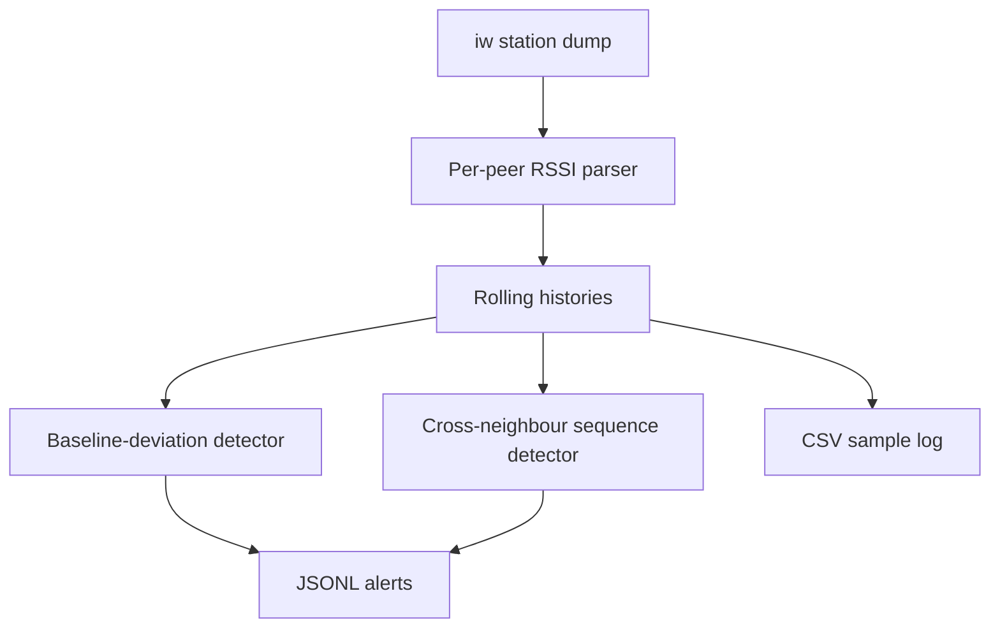

# Lab 04 — Per-Neighbour RSSI Monitoring and Anomaly Detection

## Objective

Develop and validate a continuous RSSI-monitoring tool for Linux Wi-Fi and
mesh interfaces.

The tool maintains independent RSSI histories for every connected neighbour
and implements two anomaly-detection heuristics:

1. Per-neighbour deviation from an established RSSI baseline.
2. Identical time-aligned RSSI sequences across different neighbour identities,
   indicating possible Sybil behaviour.

## Important Security Statement

This tool raises anomaly indicators. It does not cryptographically prove an
intrusion or Sybil attack.

RSSI should be combined with identity authentication, timing, channel-state
information or physical-layer fingerprints before making an enforcement
decision.

## Learning Outcomes

After completing this lab, the learner should be able to:

- Explain RSSI and dBm.
- Calculate a rolling RSSI mean.
- Establish a per-neighbour baseline.
- Detect persistent deviation from a baseline.
- Monitor multiple mesh neighbours automatically.
- Compare time-aligned RSSI sequences across identities.
- Explain why a single constant RSSI sequence is not a Sybil indicator.
- Apply consecutive-window filtering to reduce alarm noise.
- Log samples to CSV and alerts to JSON Lines.
- Anonymize peer MAC addresses.
- Test stateful detection logic using Python unit tests.

## Test Environment

| Item | Value |
|---|---|
| Operating system | Ubuntu Linux |
| Kernel | `6.17.0-40-generic` |
| Wi-Fi interface used for live test | Internal managed interface |
| Mesh deployment interface | Configurable |
| RSSI source | `iw dev INTERFACE station dump` |
| Implementation | Python standard library |
| External Python dependencies | None |

Peer MAC addresses are excluded from public test results.

## 1. RSSI and dBm

Linux commonly reports received Wi-Fi signal strength in dBm:

```text
signal: -55 dBm
```

dBm is power relative to 1 milliwatt:

\[
P_{\mathrm{dBm}}=
10\log_{10}\left(\frac{P_{\mathrm{mW}}}{1\mathrm{mW}}\right)
\]

Converting from dBm:

\[
P_{\mathrm{mW}}=10^{P_{\mathrm{dBm}}/10}
\]

Less-negative values represent stronger received power:

```text
−40 dBm is stronger than −60 dBm
```

Useful power relationships:

| Difference | Approximate power ratio |
|---:|---:|
| 3 dB | 2× |
| 6 dB | 4× |
| 10 dB | 10× |
| 20 dB | 100× |

RSSI is affected by distance, antenna orientation, polarization, obstacles,
multipath, interference, transmit-power control and driver calibration.

## 2. Per-Neighbour Measurements

Linux exposes connected stations using:

```bash
iw dev INTERFACE station dump
```

For a managed station interface, the associated access point normally appears
as one station entry.

For a mesh interface, directly connected mesh peers may appear as multiple
station entries:

```text
Station NEIGHBOUR_A
    signal: -54 dBm

Station NEIGHBOUR_B
    signal: -61 dBm

Station NEIGHBOUR_C
    signal: -58 dBm
```

The script automatically creates independent state for every station identity.

## 3. Monitoring Architecture



## 4. Rolling Mean

For neighbour \(i\), the rolling mean over window \(W\) is:

\[
\bar r_i(t)=
\frac{1}{W}
\sum_{k=0}^{W-1}r_i(t-k)
\]

Example with five samples:

```text
−55, −55, −55, −54, −54
```

\[
\bar r=
\frac{-55-55-55-54-54}{5}
=-54.6\text{ dBm}
\]

A rolling mean reduces the effect of isolated measurement fluctuations.

## 5. Baseline Calibration

Every newly discovered neighbour is initially calibrated independently.

For \(N_c\) calibration samples:

\[
\mu_i=
\frac{1}{N_c}
\sum_{k=1}^{N_c}r_i(k)
\]

The implementation keeps this baseline fixed after calibration.

A new neighbour joining later receives its own calibration period.

A short calibration is convenient for testing, but an operational deployment
should use a longer period under representative normal conditions.

## 6. RSSI-Deviation Detection

Deviation is calculated as:

\[
D_i(t)=|\bar r_i(t)-\mu_i|
\]

An alarm candidate exists when:

\[
D_i(t)\ge T
\]

where \(T\) is the configured deviation threshold in dB.

Absolute deviation detects both:

- A stronger-than-expected signal
- A weaker-than-expected signal

An alarm is emitted only after the condition persists for a configured number
of consecutive windows.

Example:

```text
Baseline:                  −55 dBm
Rolling mean:              −49 dBm
Absolute deviation:          6 dB
Threshold:                    4 dB
Required consecutive hits:   3
```

The third consecutive violating window produces one `RSSI_DEVIATION` alarm.

The alarm is not repeated on every poll while the condition remains active. A
normal window resets the detector and allows a later alarm.

## 7. Why Single-Neighbour Flatline Detection Is Disabled

During a live test, one legitimate stationary link produced eight identical
integer readings:

```text
−55, −55, −55, −55, −55, −55, −55, −55
```

This triggered the original single-peer flatline heuristic.

The result was a false positive because Linux drivers commonly quantize RSSI to
integer dBm values. A stable link may legitimately report the same value many
times.

Therefore:

```text
One constant neighbour sequence → accepted by default
```

Optional single-neighbour flatline diagnostics remain available through
`--flatline-samples`, but the default value is zero, which disables them.

## 8. Cross-Neighbour Sybil Heuristic

The intended Sybil heuristic compares different neighbour identities.

Example:

```text
Neighbour A: −55, −54, −55, −56, −55, −54
Neighbour B: −55, −54, −55, −56, −55, −54
Neighbour C: −62, −61, −63, −62, −60, −61
```

A and B have identical time-aligned sequences. C does not match them.

For neighbours \(i\) and \(j\), exact matching requires:

\[
r_i(t-k)=r_j(t-k)
\]

for every sample in the comparison window.

The default tolerance is:

```text
0 dB
```

Therefore, the sequences must match exactly.

The detector also requires several consecutive matching windows before
emitting:

```text
POSSIBLE_SYBIL_CORRELATION
```

## 9. Why Consecutive Windows Are Required

A single equal RSSI sample is common:

```text
Neighbour A: −55 dBm
Neighbour B: −55 dBm
```

That is insufficient evidence.

The detector instead requires:

```text
Complete matching sequence
        +
Several consecutive matching windows
```

This reduces alarms caused by occasional equality.

Once a pair is active, the same alarm is not emitted on every poll. A mismatch
resets the pair and permits a future alarm if correlation returns.

## 10. Missing-Peer Handling

If a neighbour disappears from one polling round, its rolling history is
cleared.

This prevents comparing:

```text
Old samples from neighbour A
```

with:

```text
Newer samples from neighbour B
```

as though they were time-aligned.

The calibrated baseline remains available for a returning identity, but its
rolling window must refill.

## 11. Script

The implementation is located at:

```text
scripts/mesh_rssi_guard.py
```

Basic usage:

```bash
./scripts/mesh_rssi_guard.py \
    --interface MESH_INTERFACE
```

Example with explicit parameters:

```bash
./scripts/mesh_rssi_guard.py \
    --interface mesh0 \
    --interval 2 \
    --window 10 \
    --calibration-samples 30 \
    --deviation-threshold 4 \
    --deviation-consecutive 3 \
    --sybil-window 10 \
    --sybil-tolerance 0 \
    --sybil-consecutive 3 \
    --anonymize \
    --csv /tmp/mesh-rssi.csv \
    --alerts /tmp/mesh-rssi-alerts.jsonl
```

## 12. Important Parameters

| Argument | Meaning | Default |
|---|---|---:|
| `--interface` | Wireless interface | Required |
| `--interval` | Seconds between polls | 2 |
| `--window` | Rolling-mean window | 10 |
| `--calibration-samples` | Baseline samples per peer | 20 |
| `--deviation-threshold` | Allowed baseline deviation | 4 dB |
| `--deviation-consecutive` | Persistent deviation windows | 3 |
| `--sybil-window` | Cross-neighbour sequence length | 8 |
| `--sybil-tolerance` | Allowed per-sample difference | 0 dB |
| `--sybil-consecutive` | Matching windows before alarm | 3 |
| `--flatline-samples` | Optional single-peer flatline window | 0/disabled |
| `--anonymize` | Hash peer identifiers in output | Disabled |
| `--csv` | Sample log path | `/tmp/mesh-rssi-samples.csv` |
| `--alerts` | Alert log path | `/tmp/mesh-rssi-alerts.jsonl` |

## 13. CSV Output

Sample schema:

```text
timestamp,peer,rssi_dbm,rolling_mean_dbm,baseline_dbm,deviation_db,state
```

An anonymized row resembles:

```text
2026-08-17T00:45:40+04:00,peer-abcdef1234,-55,-55.00,-54.60,0.40,normal
```

The `state` field can include:

- `normal`
- `deviation`
- `flatline` only when explicitly enabled

Cross-neighbour possible-Sybil alarms are written to the alert log because they
involve a pair rather than one CSV sample row.

## 14. JSON Lines Alerts

Example deviation alert:

```json
{
  "type": "RSSI_DEVIATION",
  "peers": ["peer-abcdef1234"],
  "message": "rolling mean differs from baseline by 6.00 dB"
}
```

Example correlation alert:

```json
{
  "type": "POSSIBLE_SYBIL_CORRELATION",
  "peers": ["peer-abcdef1234", "peer-987654abcd"],
  "message": "RSSI sequences matched within 0.00 dB over 8 samples"
}
```

Each line is an independent JSON object, making the log suitable for streaming
and ingestion.

## 15. Privacy

Without `--anonymize`, operational logs contain peer MAC addresses so an
operator can identify the affected neighbour.

With `--anonymize`, each MAC address is converted into a stable truncated
SHA-256 label:

```text
peer-abcdef1234
```

The raw MAC address is not written to CSV, JSONL or terminal output.

Hashing without a secret key is pseudonymization, not strong anonymization. An
observer with a small candidate set of MAC addresses may reproduce the hash.
Operational privacy can be improved later using a keyed HMAC.

Do not commit live operational logs to the public repository.

## 16. Live Single-Neighbour Test

A managed Wi-Fi interface was monitored for 20 samples.

Observed baseline:

```text
−54.6 dBm
```

Observed maximum rolling-mean deviation:

```text
0.4 dB
```

No deviation alarm occurred because the threshold was 4 dB.

The original flatline heuristic produced an alarm from repeated `−55 dBm`
readings. This result motivated disabling single-neighbour flatline detection
by default.

The anonymized output contained no raw MAC addresses.

## 17. Unit Tests

Tests are located at:

```text
tests/test_mesh_rssi_guard.py
```

Run:

```bash
python3 -m unittest discover \
    -s tests \
    -p 'test_*.py' \
    -v
```

From the Lab 04 directory.

Alternatively, from the repository root:

```bash
python3 -m unittest discover \
    -s labs/04-rssi-experiments/tests \
    -p 'test_*.py' \
    -v
```

Test coverage includes:

- Rolling mean requires a complete window.
- Rolling mean uses the latest samples.
- Identical neighbour sequences match.
- Different neighbour sequences do not match.
- One neighbour produces no comparison pair.
- Incomplete histories do not match.
- Optional tolerance behaves correctly.
- Pair alarms require consecutive matches.
- Active pair alarms are not repeatedly emitted.
- A mismatch resets a pair.
- Deviation alarms require consecutive violations.
- Active deviation alarms are not repeatedly emitted.
- Sub-threshold deviation resets the detector.
- Absolute deviation is calculated correctly.
- Anonymized peer labels are stable.

Result:

```text
Ran 15 tests
OK
```

## 18. Mesh Example

For three connected neighbours:

```text
mesh0
├── Neighbour A
├── Neighbour B
└── Neighbour C
```

The script maintains:

```text
history[A], baseline[A]
history[B], baseline[B]
history[C], baseline[C]
```

It performs:

```text
Per-peer checks:
A against baseline A
B against baseline B
C against baseline C

Cross-peer checks:
A versus B
A versus C
B versus C
```

For \(N\) neighbours, the number of pairs is:

\[
\frac{N(N-1)}{2}
\]

For three neighbours:

\[
\frac{3(3-1)}{2}=3
\]

For ten neighbours:

\[
\frac{10(10-1)}{2}=45
\]

The pairwise correlation cost therefore grows as:

\[
O(N^2W_s)
\]

where \(W_s\) is the Sybil comparison-window length.

## 19. Limitations

RSSI correlation alone can produce false positives because:

- Legitimate nodes may be co-located.
- Drivers quantize RSSI values.
- Multiple nodes may share similar propagation paths.
- Static environments may produce low variation.
- A sophisticated attacker may vary transmit power.
- Different radios can still produce correlated measurements.
- One attacker can rotate identities rather than expose them simultaneously.

RSSI deviation can also be caused by:

- A person blocking the path
- Antenna movement
- A door opening or closing
- Legitimate node movement
- Transmit-power adaptation
- Multipath fading
- Interference

Therefore, alarms should feed a larger decision engine rather than directly
blocking a neighbour.

## 20. Recommended Security Fusion

A stronger detector can combine:

- Cryptographic node identity
- Authenticated mesh peering
- RSSI from multiple observers
- CSI similarity
- Carrier-frequency offset
- Hardware/PHY fingerprints
- Packet inter-arrival timing
- Sequence numbers
- Challenge-response authentication
- Location consistency

A Sybil attacker claiming multiple identities from one radio is more reliably
detected when several independent physical observations agree.

## Key Findings

1. Linux exposes per-neighbour RSSI through `iw station dump`.
2. Each neighbour requires an independent baseline and rolling history.
3. Persistent mean deviation is more reliable than a single RSSI sample.
4. A single constant RSSI sequence is normal and is not a Sybil indicator.
5. Identical time-aligned sequences across different identities are suspicious.
6. Consecutive-window filtering prevents repeated one-sample alarms.
7. Missing peers require history reset to preserve time alignment.
8. RSSI alarms are probabilistic evidence, not cryptographic proof.
9. CSV and JSONL provide separate sample and alert records.
10. Fifteen unit tests validate the core detector logic.

## Conclusion

The implemented monitor automatically observes all stations reported on a
selected wireless interface. It detects persistent per-neighbour RSSI
deviation and exact sequence correlation across different neighbour
identities.

The design deliberately treats these results as anomaly indicators requiring
corroboration rather than definitive intrusion or Sybil-attack decisions.
